# Module 1: Getting Started
## Accessing Amazon Quick Suite - Quick Automate

Quick Automate is part of the Amazon Quick Suite family of AI services, which can be found across the console, CLI or IDE, among others. The Amazon Quick Suite - Quick Automate is part of the business oriented personas services in Amazon Quick Suite, where you will be able to create your own complex manual business processes and automate quick to save time and money.

---

To access Quick Automate, you just need to access Amazon Quick Suite by typing it in the console search bar:

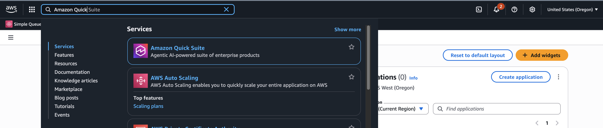

Or directly open in a new tab [Amazon Quick Automate](https://us-west-2.quicksight.aws.amazon.com/sn/start/home)

---

Once in Amazon Quick Suite, you will be able to see new sections added:
- **QUICK AUTOMATE:** Access to Amazon Q Automate list of automation projects to edit or create new ones.
- **CONNECT APPS AND DATA:** Integrations: Set up connectors against external apps to automate tasks.

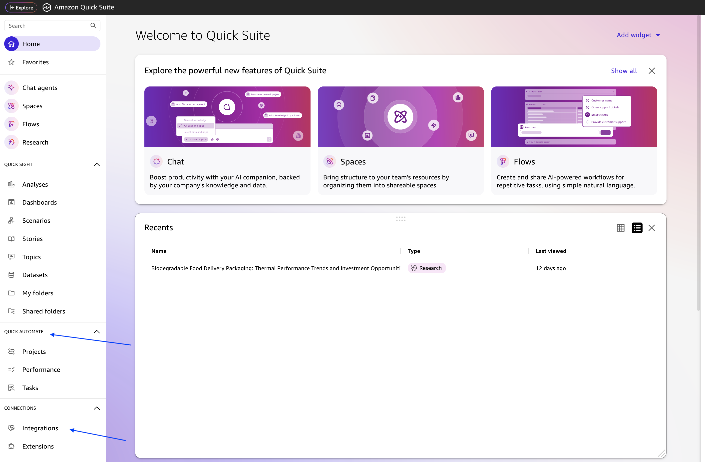

---

## Create an Automation
To create a new automation workflow, you will need to create an Automation Group, in order to group all automation workflow from a specific domain and for easier sharing across users and groups.
- Click on **Manage groups** and then click on **Create group.**

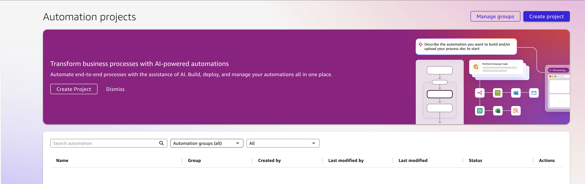

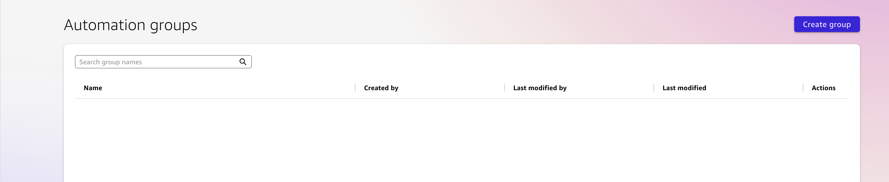

- Now lets add group details.
- Add a Name `Website-Extraction-Process` and optional Desctiption to the group and click on **Next.**

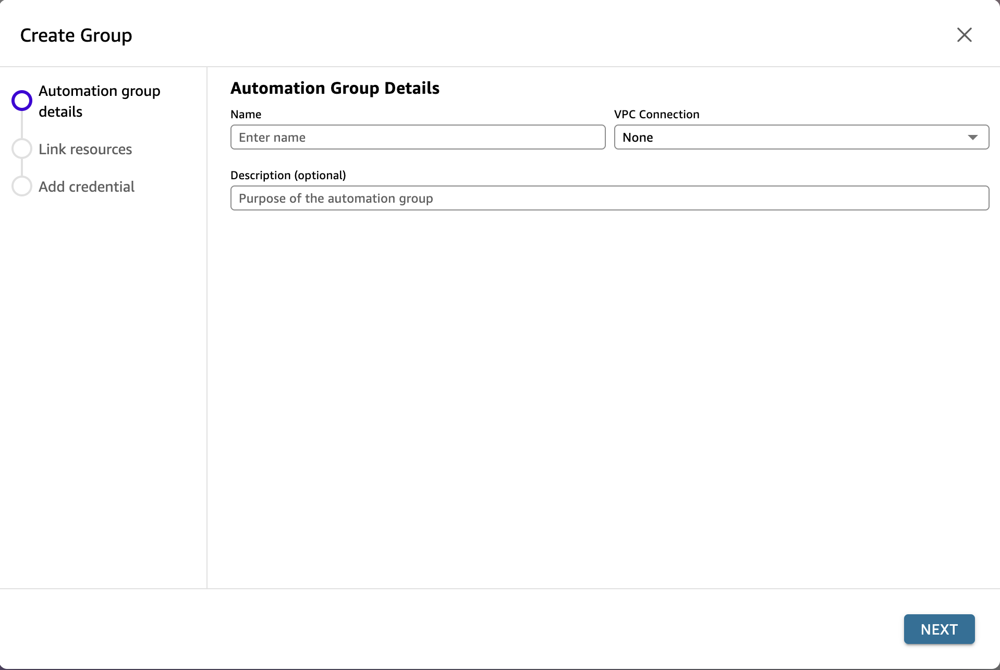

- Link all Connectors created during the pre-requisities step and click on **Next**

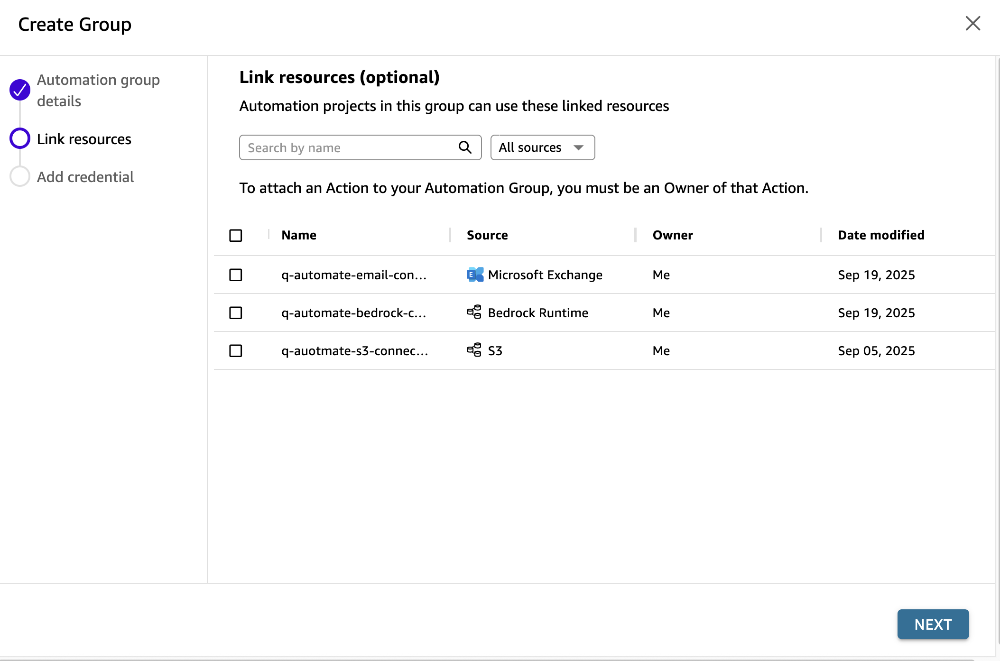

- Click **Done** to create the automation group.

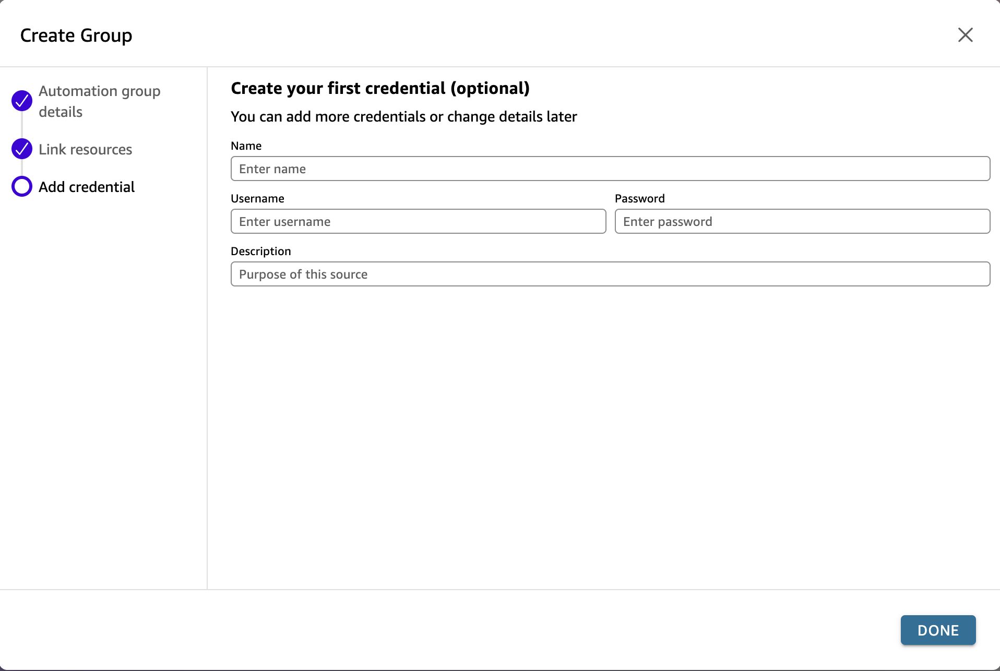

- Then, go back **Automation** and click on **Create Project.**

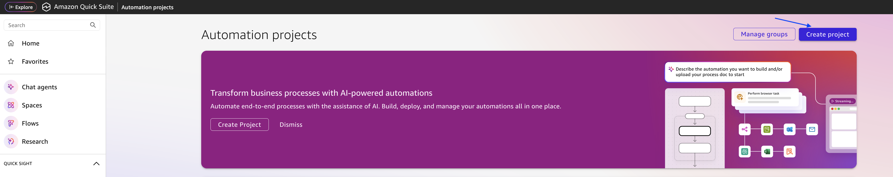

- Add a Project Name - `AWS-announcement-Process-Workflow`, select the Automation Group created before **Website-Extraction-Process** and optionally add a process description.

Also, you can optionally add specific details regarding the workflow effort, savings and goals.

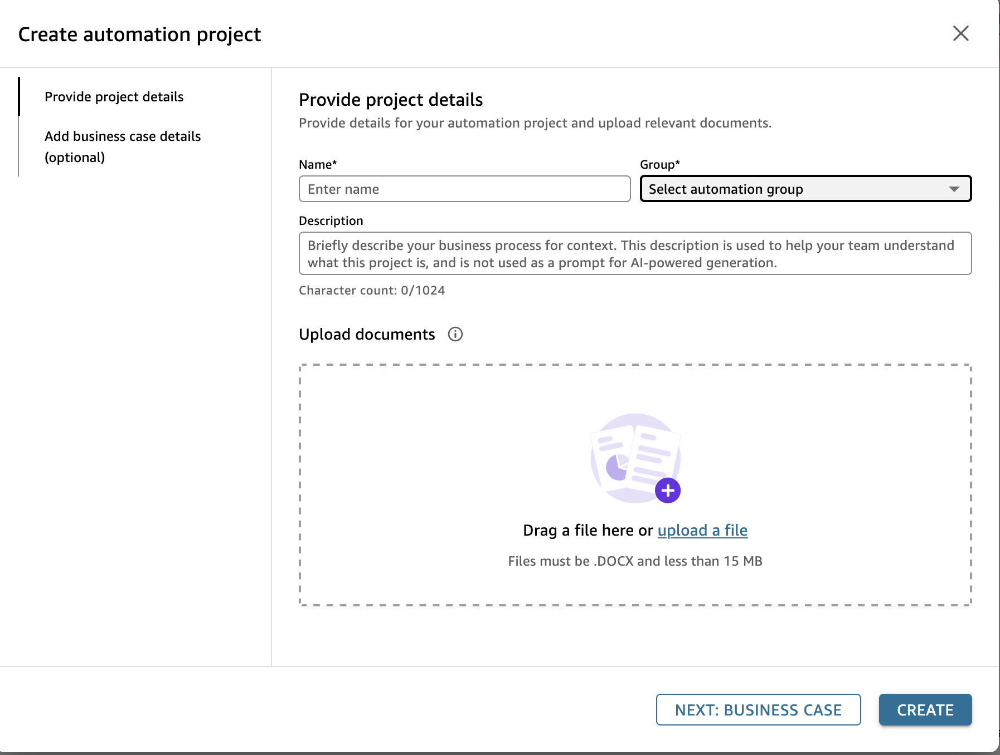

- Finally, to create the automation workflow, click on **START BUILDING.**
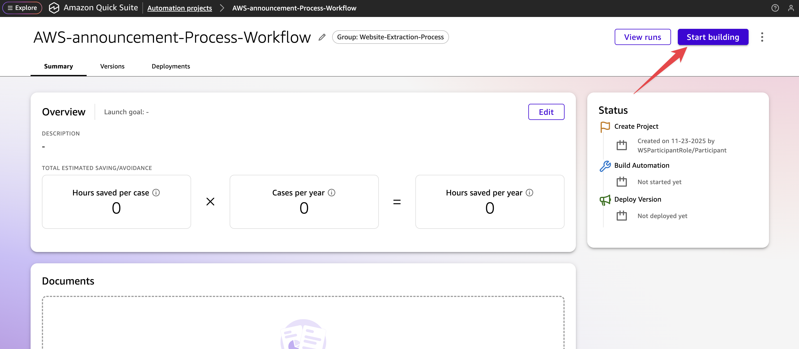

- A screen opens up, here you have 3 options -
  - To describe the use-case in natural language and Amazon Quick Suite - Quick Automate will build the workflow.
  - To get started with the samples and
  - To manually build the workflow.

We will build the workflow by using natural language to automate the workflow (with GenAI assist). 
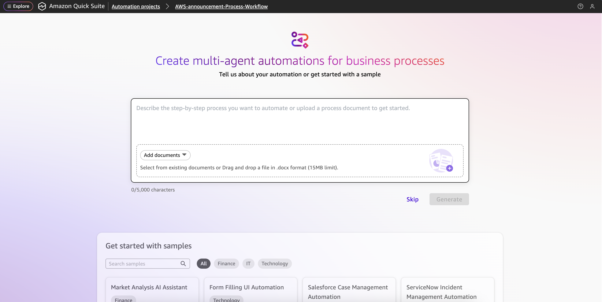

In the next section, you will have an overview of the Workflow Studio.