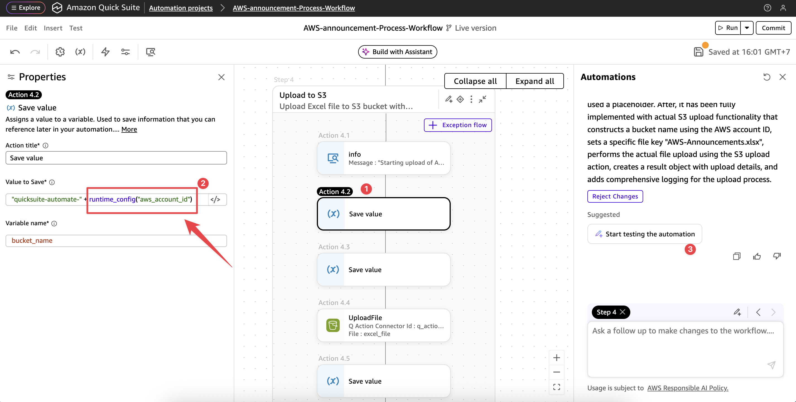
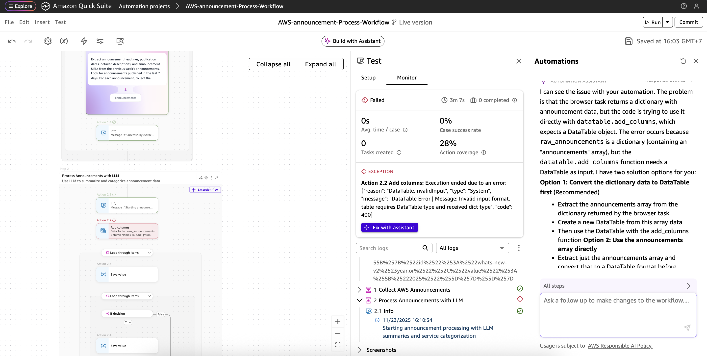
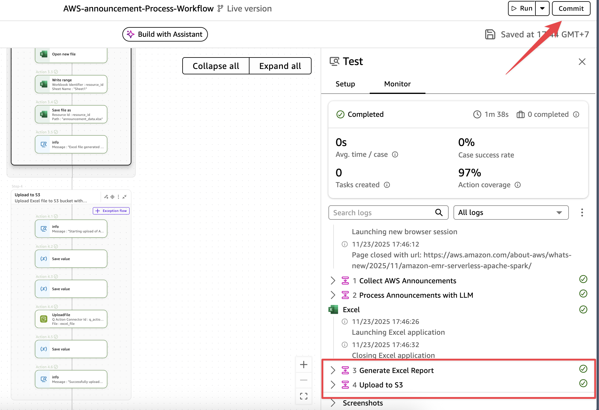
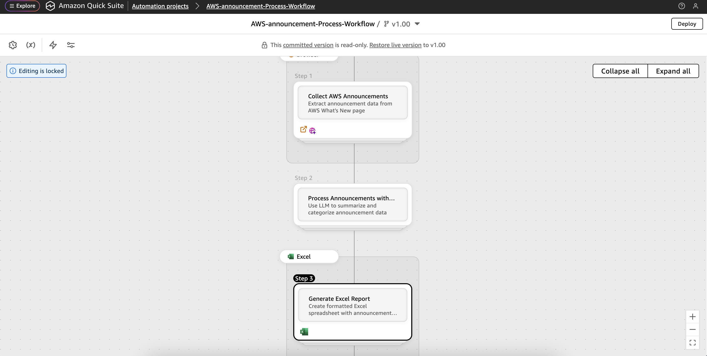
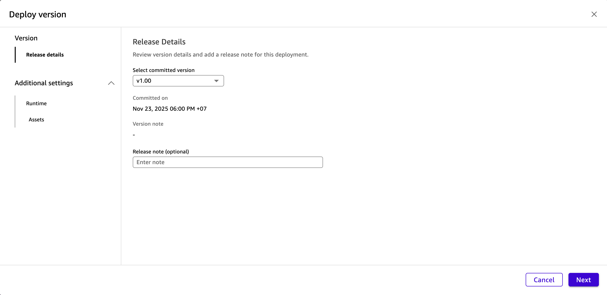
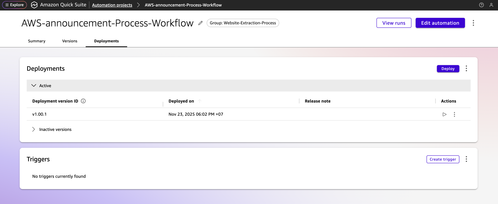
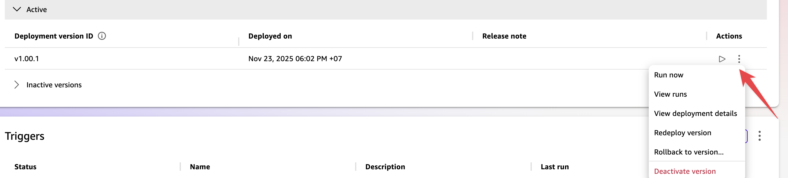
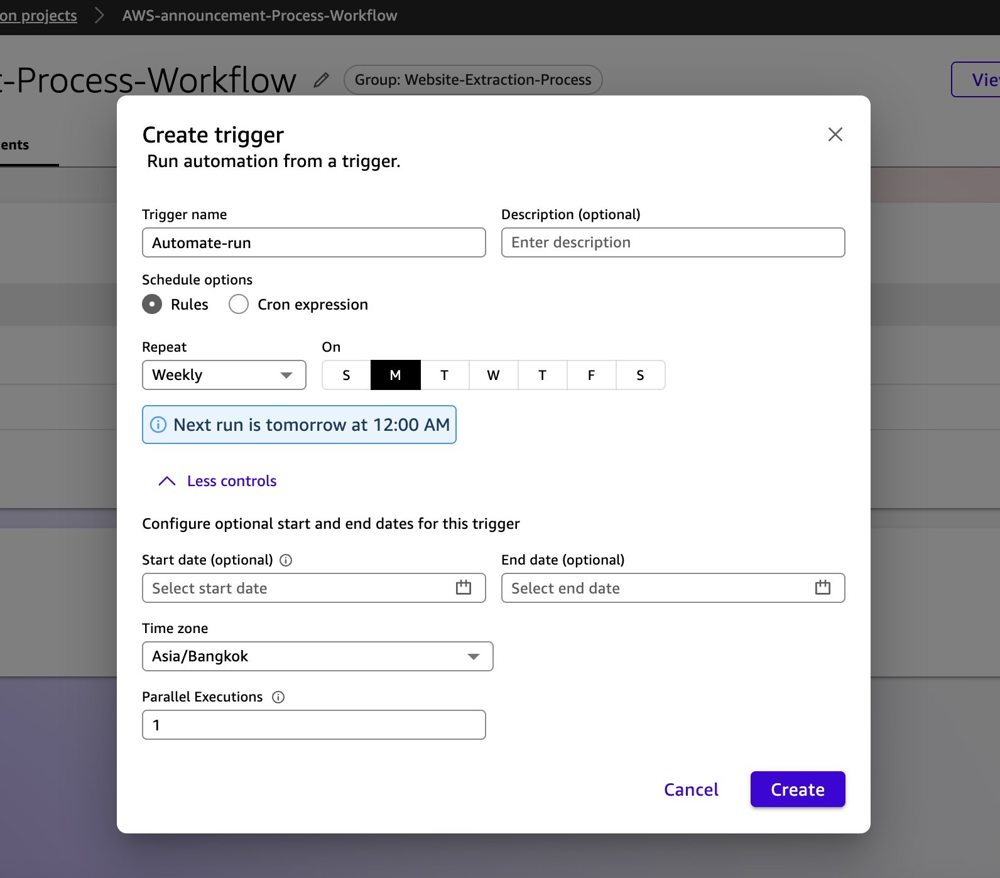
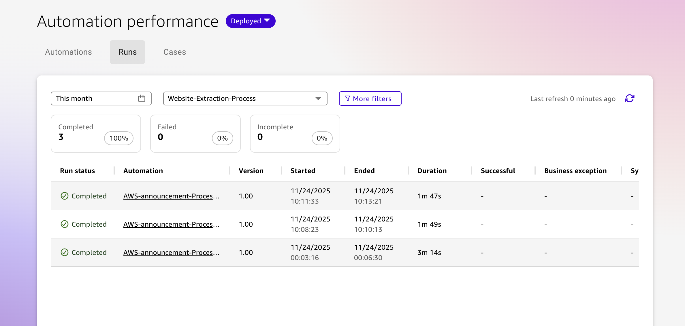

# Module 2: Build the Automate Workflow

## Overview
Ok, we are all set to start building a workflow automation using Amazon Quick Suite - Quick Automate!

Creating an AWS Announcements Monitoring Automation in Quick Automate.
This automation will monitor AWS announcements weekly, extract key information, and generate formatted Excel reports stored in S3.

- You can ignore a step below if you continue from previous Section. 
- Navigate to the Amazon Quick Suite, Quick Automate Project and Select the previous project that you just created it earlier. Click **Start Building**  


- You can start with Samples like *Market Analysis AI Assistant*, *Form Filling UI Automation*, *Weather Forecast Agent*, or else in Sample prompt libraty to explore the Quick Automat capabilities. However, for this hands-on lab instruction we will use the the prompt below.

- Copy and Paste this instruction prompt in the input box. 

```
Create a weekly automation that monitors AWS announcements from aws.amazon.com/new/ and use LLM to summary the key highlight how it handy from that particular announcement.
Note: Please be mindful when interacting with displayed links and processes them into an Excel report stored in S3. The workflow should:
Schedule: Run every Monday at 9 AM to collect the previous week's announcements
Data Collection: Extract announcement headlines, publication dates, and detailed descriptions from the AWS What's New page
Data Processing: Structure the data with columns for:
- Announcement Date
- Headline/Title
- Service Category (e.g., EC2, S3, Lambda)
- Brief Description
- Full Details/Summary
- Announcement URL
Output: Generate an Excel spreadsheet with formatted data
Storage: Upload the completed Excel file to S3 bucket [quicksuite-automate-{AWS-ACCOUNT-ID}] with filename format 'AWS-Announcements.xlsx'
```

<div style="background: #e7f3ff; border-left: 4px solid #0972d3; padding: 12px; margin: 16px 0;">
  <strong>Note:</strong> Don't forget to change the AWS-ACCOUNT-ID to your account ID
</div>

- Then click **Generate**

- Waiting for a few minutes, then you will get 4 step generated by Quick Automate.
  - **Step 1 :** Collect AWS Annountment from https://aws.amazon.com/new/
  - **Step 2 :** Process Announments with LLM
  - **Step 3 :** Generate Excel Report
  - **Step 4 :** Upload Excel Report to S3 Bucket

Review the Automatation workflow and Automate Assistance summary. 


## Generate first step
Quick Automate will help you create a weekly automation to monitor AWS announcements and generate summarized reports. Let me build the high-level workflow structure for this automation.

- Click on **Review and generate first step** button to generate the first step of the automation.


- You will see the first step generated by Quick Automate, Click **Generate** button to generate the first step.


- After wait for a few seconds, you will see the first step of the automation is generated.


- In Step 1, click on expand to see the details of the step. You'll see Quick Automate use Web Browser with **Go to webpage** action to get the contents and extract the contents base on your instruction automatically.


- You can Start testing and see how the automation work by click on **Start testing the automation** button.


- Amazon Quick Automate will start test based on the action defined and get the result for you without addional configuration or step by step instruction for agent to do so. 


- Once test is complete and satified, You can click on **Review and generate next step** button on the right hand side.

## Generate Second step

- Review the Step instruction and Click on **Generate** 


- Check on the Step 2 for the details, feel free to modify or change or leave it as remain the same then click on **Review and generate next step** button on the right hand side.


## Generate Third step
- Review the Step instruction and Click on **Generate**, and repeat the same activity on Review and generate next step button on the right hand side.


## Generate Fourth step
- Review the Step instruction and Click on **Generate** 


- After the generating process is completed, Verify if the **"aws-account-id"** doesn't set with the right AWS Account ID in 13 digit number. This will use for upload the Excel file to S3 bucket properly. 


Once satisfied, Click **Start testing the automation** button to see how the automation work.

## The issue
- When automation issues arise and don't function as expected, we need to resolve them promptly. Quick can assist us with fixing these exceptions-We can ask Quick to help us out!


- It would take a little effort for fix the exception issue. 
Click on **Start testing the automation** button to see how the automation work.


- Once test result successfully, you can click on **Commit** button and go to next step.
However, you can do a prior step to verify the Excel spreadsheet already in S3 Bucket that you create in early stage of this workshop.


## The Final Step
- After you click on **Commit** button, you will see the automation is successfully created and ready to use. click on **Commit** button once again.


- Now your Automate workflow is ready to deploy. Click on **Deploy** button to deploy the automation.


- Click **Next**, until **Deploy** button is selected.


- After wait for a few seconds, you will see the automation is deployed and ready to use.


- You can test run the automation by click on **Run** button, or click on Kebab menu and select **Run Now** or see other options.


- While waiting job to run, You can create the trigger to run the job by click on **Create trigger**, and specify the run criteria. 


- To monitor the job status you can click on **View runs** button on the right top corner. One the job is successfully run, you can see the result in the S3 bucket.


- That all you have set :) !

## Wrap-up
An automation is a visual artifact that represents the executable logic of a process. It is created using the Visual Designer within , where you define the sequence of actions, decisions, and agent interactions needed to complete a business process. Each automation serves as the operational blueprint for how work is performed, combining AI-powered agents, system actions, and human inputs in a unified flow.

   - Create a project: Define the automation's scope including its name, purpose, business case, and attach process documentation.
   - Build automation: Within the project, build and test and automation.
   - Version and deploy: Publish automation versions for testing or production. Projects maintain version history and deployment status.
   - Monitor and iterate: Review logs, metrics, for each run and iterate on the automation. Each iteration creates traceable - project-level change history.