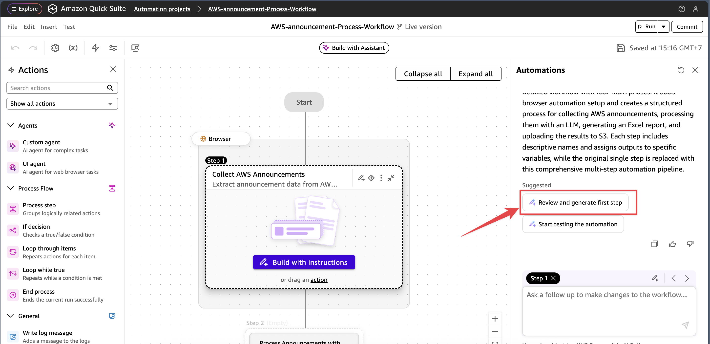
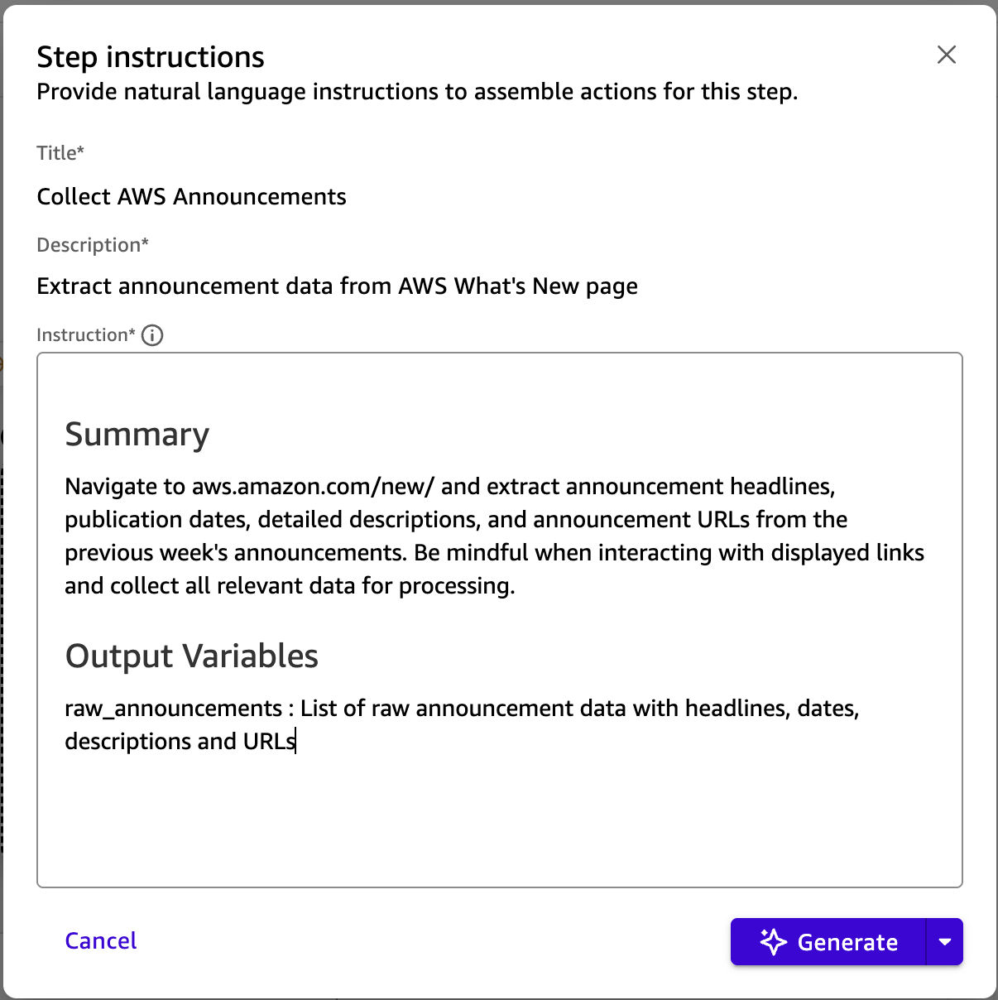
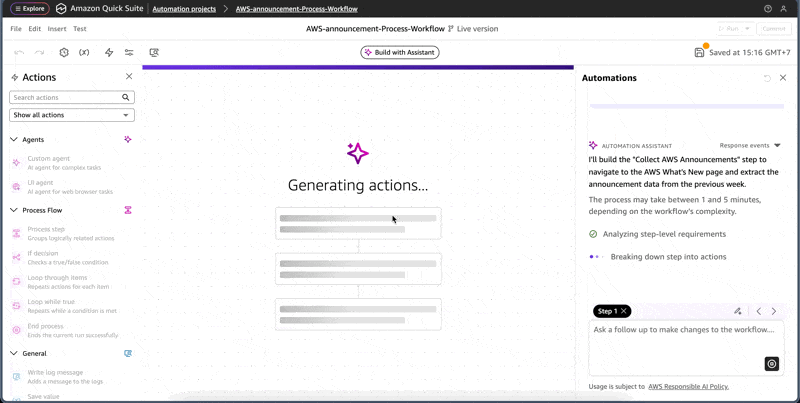
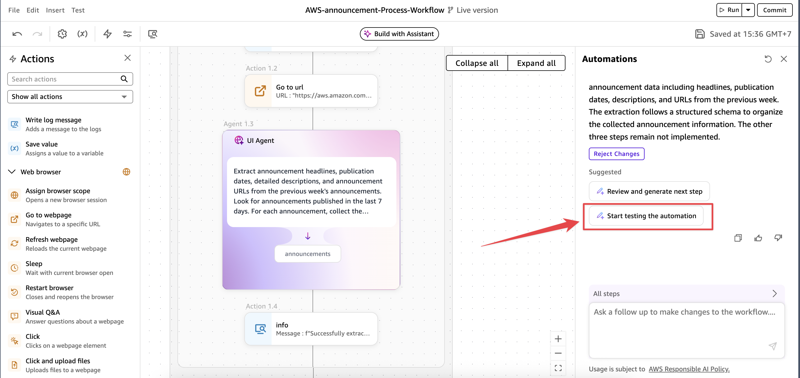
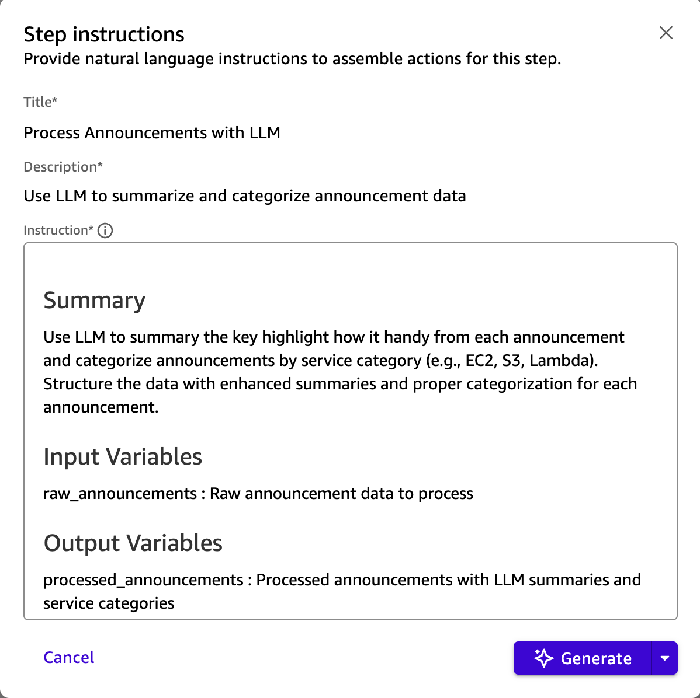
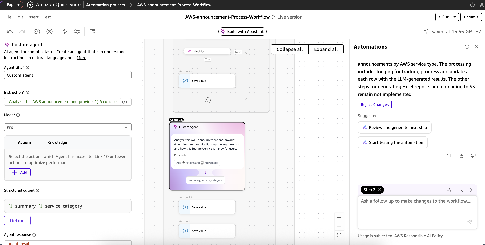
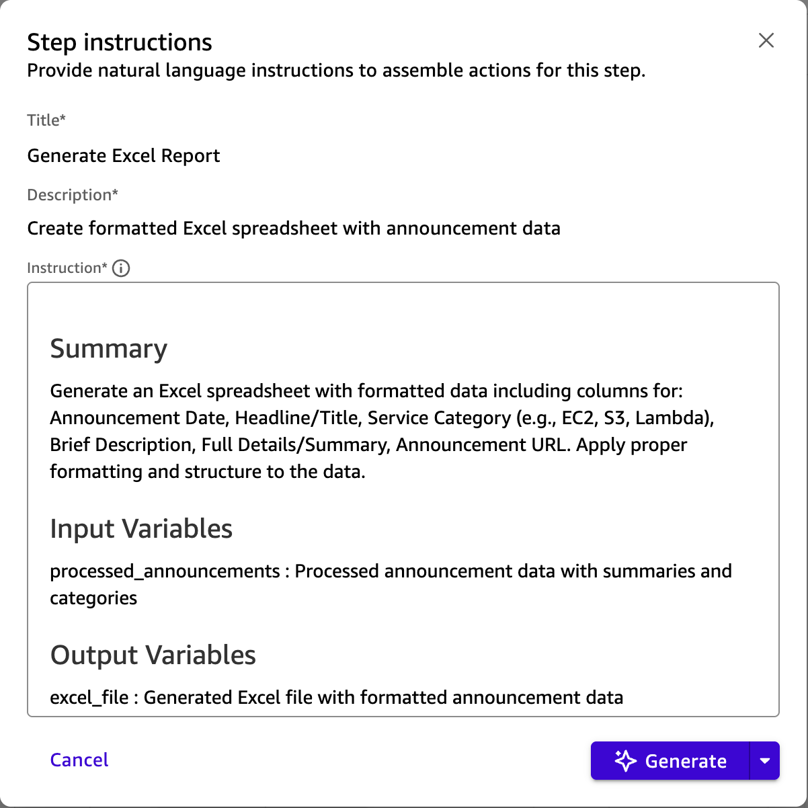

# Module 2: Build the Automate Workflow

## Overview
Ok, we are all set to start building a workflow automation using Amazon Quick Suite - Quick Automate!

Creating an AWS Announcements Monitoring Automation in Quick Automate.
This automation will monitor AWS announcements weekly, extract key information, and generate formatted Excel reports stored in S3.

- You can ignore a step below if you continue from previous Section. 
- Navigate to the Amazon Quick Suite, Quick Automate Project and Select the previous project that you just created it earlier. Click **Start Building**  


- You can start with Samples like *Market Analysis AI Assistant*, *Form Filling UI Automation*, *Weather Forecast Agent*, or else in Sample prompt libraty to explore the Quick Automat capabilities. However, for this hands-on lab instruction we will use the the prompt below.

- Copy and Paste this instruction prompt in the input box. 

```
Create a weekly automation that monitors AWS announcements from aws.amazon.com/new/ and use LLM to summary the key highlight how it handy from that particular announcement.
Note: Please be mindful when interacting with displayed links and processes them into an Excel report stored in S3. The workflow should:
Schedule: Run every Monday at 9 AM to collect the previous week's announcements
Data Collection: Extract announcement headlines, publication dates, and detailed descriptions from the AWS What's New page
Data Processing: Structure the data with columns for:
- Announcement Date
- Headline/Title
- Service Category (e.g., EC2, S3, Lambda)
- Brief Description
- Full Details/Summary
- Announcement URL
Output: Generate an Excel spreadsheet with formatted data
Storage: Upload the completed Excel file to S3 bucket [quicksuite-automate-{AWS-ACCOUNT-ID}] with filename format 'AWS-Announcements.xlsx'
```

- Then click **Generate**

- Waiting for a few minutes, then you will get 4 step generated by Quick Automate.
  - Step 1 : Collect AWS Annountment from https://aws.amazon.com/new/
  - Step 2 : Process Announments with LLM
  - Step 3 : Generate Excel Report
  - Step 4 : Upload Excel Report to S3 Bucket

Review the Automatation workflow and Automate Assistance summary. 


## Generate first step
Quick Automate will help you create a weekly automation to monitor AWS announcements and generate summarized reports. Let me build the high-level workflow structure for this automation.

- Click on **Review and generate first step** button to generate the first step of the automation.


- You will see the first step generated by Quick Automate, Click **Generate** button to generate the first step.


- After wait for a few seconds, you will see the first step of the automation is generated.


- In Step 1 click on expand to see the details of the step. You'll see Quick Automate use Web Browser with **Go to webpage** action to get the contents and extract the contents base on your instruction automatically.


- You can Start testing and see how the automation work by click on **Start testing the automation** button.


- Amazon Quick Automate will start test based on the action defined and get the result for you without addional configuration or step by step instruction for agent to do so. 


- Once test is complete and satified, You can click on **Review and generate next step** button on the right hand side.

## Generate Second step

- Review the Step instruction and Click on **Generate** 


- Check on the Step 2 for the details, feel free to modify or change or leave it as remain the same then click on **Review and generate next step** button on the right hand side.


## Generate Third step
- Review the Step instruction and Click on **Generate**, and repeat the same activity on Review and generate next step button on the right hand side.


## Generate Fourth step
- Review the Step instruction and Click on **Generate** 


- You'll see Quick Automate use Python Programming to get AWS Account ID and upload the Excel file to S3 bucket properly. 
Please note: Quick Automate only support Python Programming for now.


Once satisfied, Click **Start testing the automation** button to see how the automation work.

## The Final Step