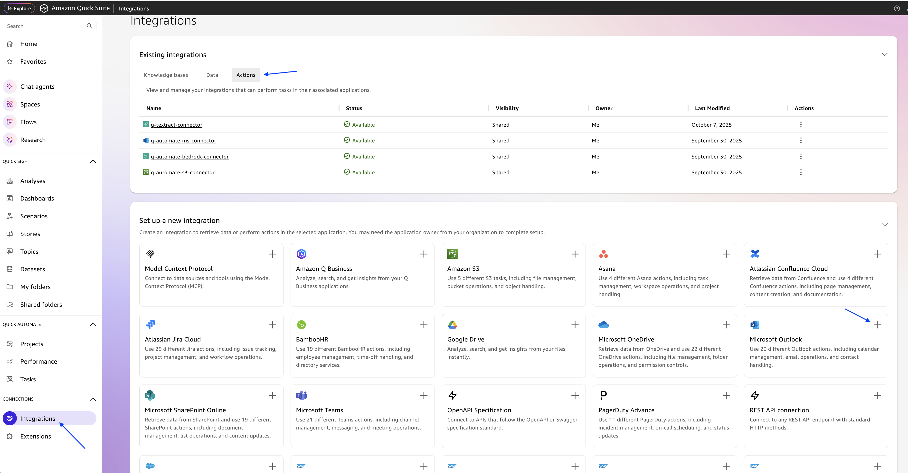
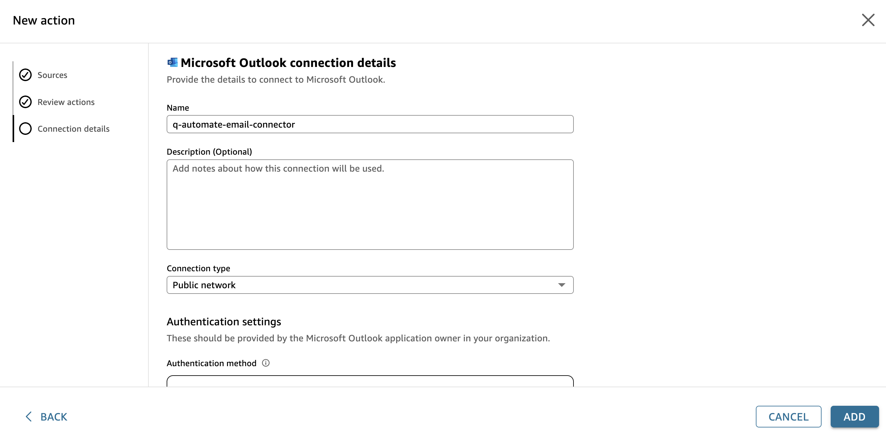
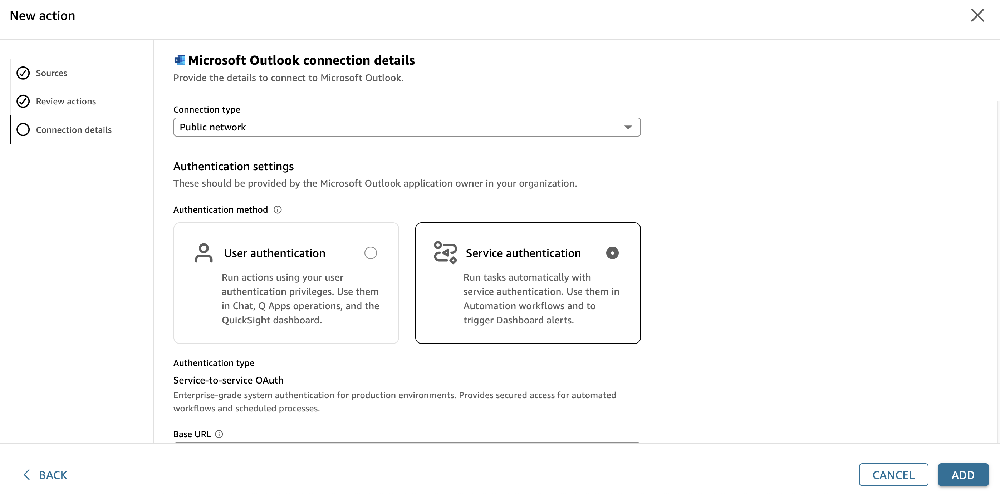
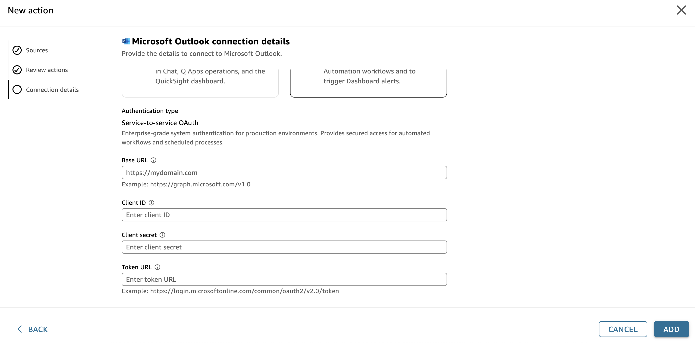
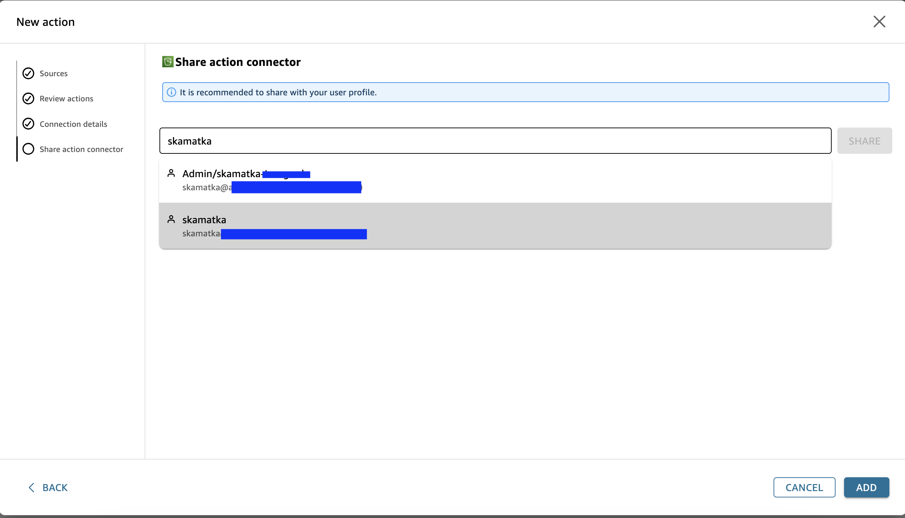
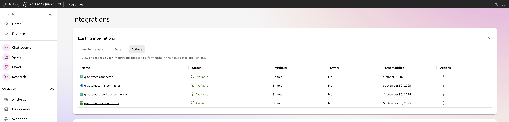

# Step 4: Configure Microsoft Outlook connector (Optional)

- Now lets create Microsoft Outlook connector. Go to Amazon Quick Suite Console menu, from the list under **CONNECTIONS** select **Integrations**. On the integrations page, go to **actions** tab and click on + for **Microsoft Outlook** Connector.

- Provide the name for the connector, under authentication, select **Service Authentication.**

- Fill in the service-to-service Oauth details for system authentication.

- Share the connector to at least one user or group to share the connector with. Click Share to add the user to the list. Then, select either Owner or User permissions. Click the Add button.

- Owner permissions are recommended if you are granting the connector to your own alias/user. This enables you to share, edit and delete the connector after creation.

- After adding the connector, you should be able to view the new connector in the list of Actions on the Amazon Quick Suite Console page. Confirm the new connector is part of the list.

